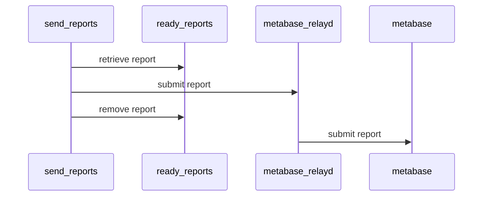

# cpan-openbsd-smoker

Configuration files and scripts to maintain a CPAN Smoker on OpenBSD.

## Description

This project includes the following:

* A VirtualBox image of OpenBSD, optimized to run as CPAN Smoker (also available
at
[Vagrant Cloud](https://app.vagrantup.com/boxes/search?order=desc&page=1&provider=virtualbox&q=arfreitas%2Fopenbsd&sort=updated&utf8=%E2%9C%93)
).
* A Packer configuration file, used to create the mentioned VirtualBox Vagrant
box.
* A Vagrant configuration file (`Vagrantfile`), Ansible playbook and a shell
scripts for provisioning
* The CPAN-Reporter-Smoker-OpenBSD Perl distribution.
* A set of CPAN
[distroprefs](https://metacpan.org/pod/CPAN#Configuration-for-individual-distributions-(Distroprefs))
files to disable distributions that causes the smoker to halt execution and also
to allow custom behavior configuration.

## The Vagrant provisioned VM

The associated VMs (see `Vagranfile`) with this project are based on Vagrant
(and Virtualbox as the provider) with the Smoker pre-configured on OpenBSD.

Currently, the VMs will use the **default perl interpreter** provided by the
Perl maintainers in the OpenBSD project. This **is not** the same perl you can
download from [perl.org](https://www.perl.org/), being the main differences:

- there are specific OpenBSD patches applied for it.
- ithreads are disabled by default.
- some common Perl distributions are also patched/different from other UNIX-like
OSes. A good example are distributions that depends on SSL (TLS), since OpenBSD
uses by defayult LibreSSL instead of OpenSSL.

All configuration is done with [local::lib](https://metacpan.org/pod/local::lib)
to allow the distributions to be installed without giving root access to the
user running the smoker.

The VM is optimized in the following ways:
- modules that passes a test are always installed: this basically exchanges
storage space to get more speed to handle dependencies of the distribution being
tested
- use of a MFS mount for the CPAN `build_dir` location, to speed up the build
process.

Many aspects of the VM can be customized during the provisioning phase, like:

* Mirrors to be used (OpenBSD and CPAN).
* Number of processors in the VM
* Generic OS customizations like keyboard, time zone, etc.
* A customable user with low privileges to execute the
`CPAN::Reporter::Smoker` application.
* Using a CPAN mirror: you can declare one already available on your local
network, configure it inside the VM or do both!
* The OpenBSD version you want to use.

The VM will have pre-installed and pre-configured:

* an optional local CPAN mirror (implemented with
[minicpan](http://search.cpan.org/search?query=minicpan&mode=all)).
* related OpenBSD packages installed (like Git, compilers, libraries and Perl
modules).
* a running MariaDB server, configured to run extended tests of
[DBD::mysql](https://metacpan.org/pod/DBD::mysql) and
[DBD::MariaDB](https://metacpan.org/dist/DBD-MariaDB/view/lib/DBD/MariaDB.pod)
automatically.
* "distroprefs" files for configuring (e.g. blocking) how distributions should
be tested under the smoker.
* several tools and libraries most used for modules that uses XS.
* automatic updates for OpenBSD packages and the
CPAN-Reporter-Smoker-OpenBSD distribution by running the provisioning again
(idempotent controls are in place to execute only the necessary).
* the command line programs provided by the
[CPAN-Smoker-Utils](https://metacpan.org/pod/CPAN::Smoker::Utils)
distribution.

### Older Vagrant boxes support

Since OpenBSD version 7.0, the boxes are implemented with
[Ansible](https://www.ansible.com/) replacing a lot of shell scripts to
implement a complex configuration process that was becoming harder and harder
to maintain.

Besides Ansible, the provisioning itself was changed and currently is much more
simple (although with less features).

Previous versions of OpenBSD that were implemented in the original fashion can
still be used by using the branch
[deprecated_provisioning](https://github.com/glasswalk3r/cpan-openbsd-smoker/tree/deprecated_provisioning)
of this repository.

## Requirements

- Virtualbox version 6.1 or higher
- Vagrant 2.2.19 or higher
- GNU Make
- Ansible version 2.12.2 or higher
- Packer 1.7.4 or higher, but only if you want to build base images

### CPAN mirror

It is expected to have a local CPAN mirror (see
[CPAN::Mini](https://metacpan.org/pod/CPAN::Mini) module for that). It
is just too much data required from your nearest mirror, so be sure to use one.

You can combine your preferred web server with the `CPAN::Mini` module in order
to achieve that. As an example, there is the `nginx-minicpan` at `utils`
directory to configure Nginx. Or you can search for Docker base solutions like
[this one](https://github.com/colinnewell/CPAN-Mirror-Docker).

## Quick start

First clone this repository. Then go to the `vagrant` directory. You should
see the following structure:

```
vagrant/
├── ansible.cfg
├── /config
├── Makefile
├── /packer
├── packer.pkr.hcl
├── playbook.yml
├── /scripts
├── /templates
└── Vagrantfile
```

Once there, you will find the `Vagrantfile`, where the main definitions of the
`CPAN::Reporter::Smoker` VM are located.

You will want to look up for the section named `CONFIGURABLE STEPS`. Some
options are required, others not. Make sure to read the comments, they are
currently the only documentation available.

Finally, make sure you are in the same directory where the `Vagrantfile` is
located and hit `vagrant up`.

After provisioning, all users including (including vagrant and root) have the
password setup to "vagrant". You might want to change that latter.

## Submitting the reports

The smoker is initially configured to save the testing reports to the local
home directory of the chosen user (`$HOME/ready_reports`). This is to allow you
to review reports before really sending them, just in case some tests failed
because of configuration mistakes with the smoker.

Later, you can setup [CPAN::Reporter](https://metacpan.org/pod/CPAN::Reporter)
to send those reports directory, but the best option would be using
[metabase-relayd](https://metacpan.org/dist/metabase-relayd/view/bin/metabase-relayd)
for that, because the reports will be dispatched much faster, relieving the
smoker to go back testing as soon as possible. See also the
[Docker image](https://hub.docker.com/r/alceu/metabase-relayd) available for it
too.

A third option would be using `send_reports` CLI from
`CPAN-Reporter-Smoker-OpenBSD` distribution:



See `send_reports --help` for the online help.

### On going usage

After initial provisioning, you will want to start your smoker with

```
vagrant up --provision
```
This project `Vagrantfile` is prepared to implement idempotent operations, so
only the operations below will be repeated:

* Updates OpenBSD packages.
* Update your local CPAN mirror
* Updates `CPAN-Reporter-Smoker-OpenBSD` distribution (available also at CPAN)
for the provisioned user.
* Updates the keyboard configuration based on the `Vagrantfile` respective
option.

#### Troubleshooting

You might broke something meanwhile using. It might be easier to look for what
is wrong than just kill your VM and start from scratch.

### Base images building

This project uses [Packer](https://www.packer.io/) to build the base images for
Vagrant. Packer allows the setup of the VM and install of OpenBSD automatically.

Sections that you probably want to tweak with are:

* variables
* builders

After `git clone`ning the project, move to `cpan-openbsd-smoker/vagrant`, where
the `packer.pkr.hcl` is located and type:

```
packer build packer.pkr.hcl
```

See also the available targets in the `Makefile`.

### Possible questions that nobody asked so far

#### Why a project for that?

It takes a considerable time to implement a CPAN smoker, so this project takes
care of automating most of it.

#### Does this works with any "basic" OpenBSD VM?

No. The VM specified in the `Vagrantfile` contains customizations. Besides, this
box already has required software installed, which reduces the provisioning time
substantially.

#### I'm a CPAN developer, can I use it for testing my own modules?

For sure you can. Any user added to the OpenBSD VM will be fully able to use
the CPAN client to test your code. There is also any tool you would require to
download, build and test your distributions.

## See also

- [CPAN Testes Reports](http://cpantesters.org/)
- [OpenBSD's patches for Perl](https://github.com/afresh1/OpenBSD-perl)
- [CPAN Testers Statistics](http://stats.cpantesters.org/)
- [CPAN::Reporter::Config](https://metacpan.org/pod/CPAN::Reporter::Config)
- [CPAN Testers 2.0 and the metabase-relayd](http://blogs.perl.org/users/bingos/2010/07/cpan-testers-20-and-the-metabase-relayd.html)

